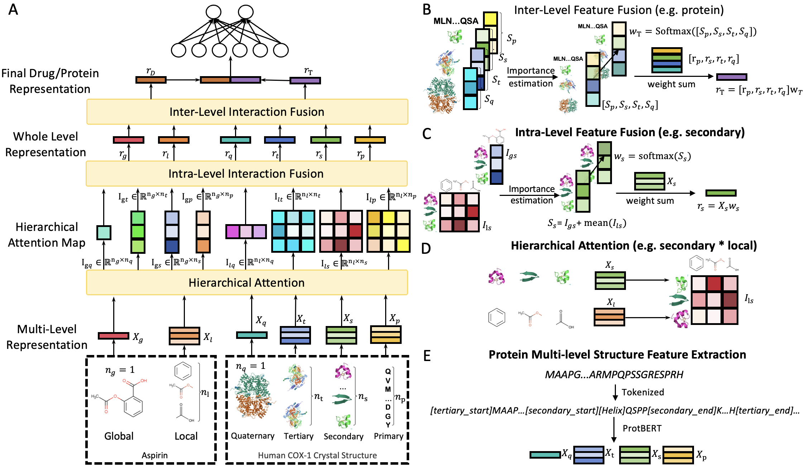

# ColdDTI: A Substructure-Aware Framework for Cold-Start Drug-Target Interaction Prediction

This repository provides the PyTorch implementation of **ColdDTI**, a framework for cold-start drug-target interaction prediction using drug representations and protein structural hierarchy annotations.

## Framework



## Environment

The code was developed with Python 3.8 and PyTorch. Install the required packages with:

```bash
pip install -r requirements.txt
```

## External Models

Pretrained models are not included in this repository. Please download the required checkpoints yourself and place them in the following local directories:

```text
../Model/
  ChemBERTa-77M-MLM/
  prot_bert/
```

Then expand the protein tokenizer vocabulary with ColdDTI structure tokens:

```bash
python3 resize.py
```

This creates:

```text
../Model/prot_resize/
```

The training and embedding scripts expect:

```text
../Model/ChemBERTa-77M-MLM/
../Model/prot_resize/
```

## Datasets

The main pipeline is intended for the datasets reported in the paper:

```text
drugbank
human
biosnap
bindingdb
```

Raw dataset files are not included. Prepare them under a sibling directory named `Dataset`:

```text
../Dataset/{dataset}/
  protein.csv
  protein_with_timestamps.csv
  smiles.csv
  {split}/
    train.csv
    val.csv
    test.csv
```

For the main pipeline, each split CSV should contain at least:

```text
smiles_nid, protein_id, Y
```

where `Y` is the binary interaction label. The preprocessing script rebuilds `protein_nid` according to the processed protein table.

The repository may still contain helper code for additional datasets, but those datasets are not part of the main reproduction pipeline described here.

## Preprocessing

Set `dataset` to one of `drugbank`, `human`, `biosnap`, or `bindingdb`. Set `split` to the split directory you want to reproduce, such as `cold_pair`, `cold_drug`, `cold_protein`, `random`, `cluster_start`, or `real_timeline`.

1. Download AlphaFold CIF files:

```bash
python3 download.py --dataset ${dataset}
```

2. Build marked protein sequences and regenerate split files:

```bash
python3 filter.py --dataset ${dataset} --types ${split}
```

This writes processed files to:

```text
./data/{dataset}/protein.csv
./data/{dataset}/{split}/train.csv
./data/{dataset}/{split}/val.csv
./data/{dataset}/{split}/test.csv
```

3. Precompute tokenized inputs and transformer embeddings:

```bash
python3 get_emb.py --dataset ${dataset}
```

This writes:

```text
./data/{dataset}/smilestokenized.npy
./data/{dataset}/smilesembeddings.npy
./data/{dataset}/proteinstokenized.npy
./data/{dataset}/proteinsembeddings.npy
```

## Training

Train and evaluate ColdDTI with:

```bash
python3 main_earlystop.py --dataset ${dataset} --split ${split} --cuda ${device}
```

Outputs are saved under:

```text
./output/{dataset}/result/
./output/{dataset}/model/
```

The trainer selects the best checkpoint using validation AUC and reports test metrics after loading the best checkpoint.

## Export Test Predictions

After training, predictions can be exported from a checkpoint:

```bash
python3 export_test_predictions.py \
  --dataset ${dataset} \
  --split ${split} \
  --ckpt ./output/${dataset}/model/${checkpoint}.pt \
  --drugbank_map_csv /path/to/smiles_with_drugid.csv
```

The `--drugbank_map_csv` file is only needed when exporting DrugBank identifiers and should contain:

```text
smiles_nid, drugbank_id
```

## Notes

- The scripts currently use local relative paths such as `../Model` and `../Dataset`. If your files are stored elsewhere, update the paths in the scripts or create matching directories.
- `get_emb.py` uses CUDA directly for embedding generation. On a CPU-only machine, modify the device handling before running preprocessing.
- Generated CIF files, embeddings, checkpoints, and output logs can be large and are not intended to be committed to Git.

## Citation

Please cite the ColdDTI paper if you use this code.
